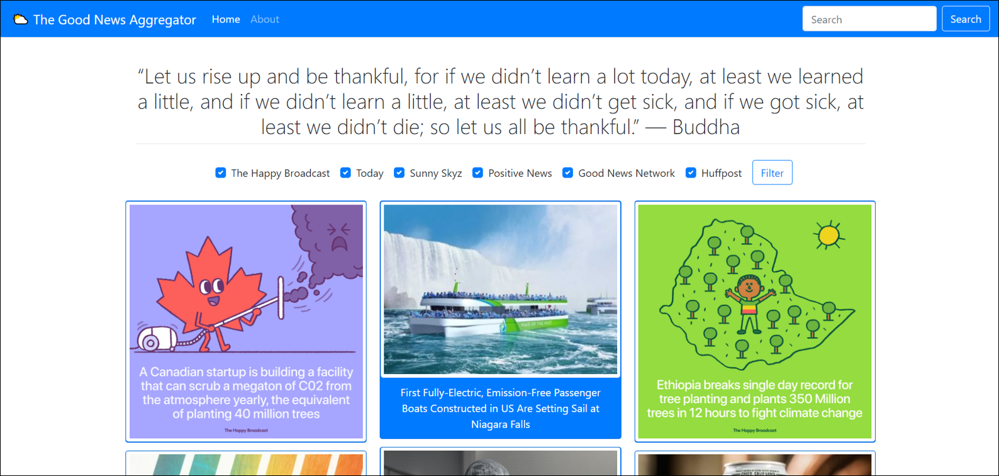
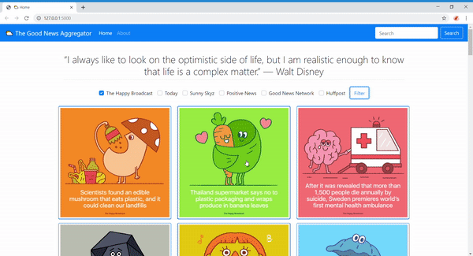

# **The Good News Aggregator**

## **Table of Contents**

 * [Introduction](introduction)
 * [Learning Objectives](learning-objectives)
 * [Link to Web App](link-to-web-app)
 * [Site Features](site-features)
 * [Technologies](technologies)

## **Introduction**

The Good News Aggregator is a web application that scrapes news articles from various news websites that specifically publish news that is considered good/positive/uplifting. With much of the world focusing on negative storylines, this application aims to remind us of the great things happening in the world every day.

## **Learning Objectives**

The goal of this project was to apply what I had learned from CS50x to develop a web application, scrape news articles from various websites, display content dynamically, and manage a SQLite database.

## **Link to Web App**

TO BE ADDED 

## **Site Features**

### **Filter by Website**

### **Load More Articles**

### **Search Button**

## **Technologies**

### **Front-end Technologies**

  * HTML5
  * CSS3
  * JavaScript ES6
  * jQuery 3.4.1
  * Bootstrap 4.3.1

### **Back-end Technologies**

  * Python 3.7.2
  * Flask 1.1.1
  * BeautifulSoup 4.8.0
  * Selenium 3.141.0

### **Database Technology**

  * SQLite3